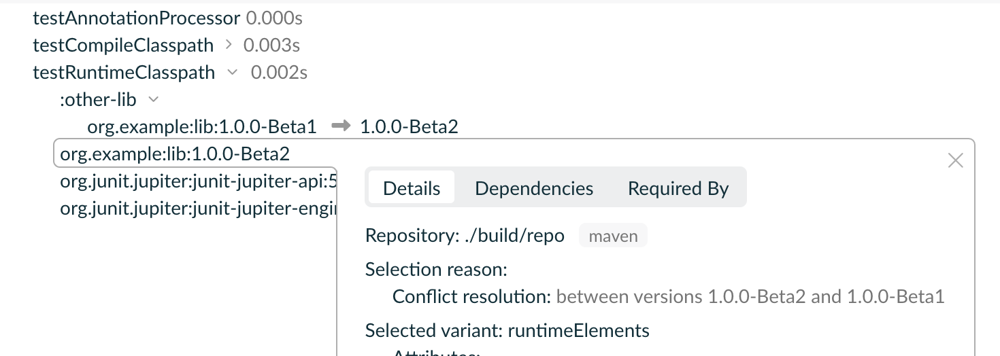
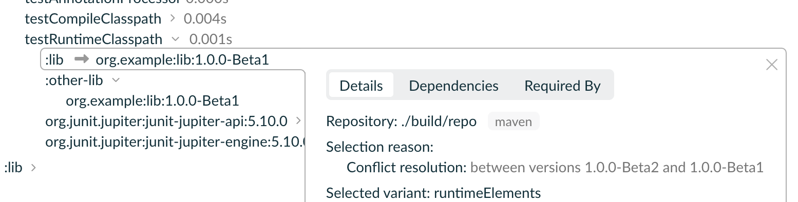

# Strange Gradle dependency resolution sample

### Steps to reproduce the expected behavior:

1. `./gradlew clean`
2. `./gradlew -PincludeLib=true -Ppublish=true publish -PmyVersion=1.0.0-Beta1`
3. `./gradlew -PincludeLib=true -Ppublish=true publish -PmyVersion=1.0.0-Beta2`
4. `./gradlew test --scan`

The setup will add both `org.example:lib:1.0.0-Beta1` and `org.example:lib:1.0.0-Beta2`,
then the Gradle resolver will choose `org.example:lib:1.0.0-Beta2`

### Steps to reproduce the unexpected behavior:

1. `./gradlew clean`
2. `./gradlew -PincludeLib=true -Ppublish=true publish -PmyVersion=1.0.0-Beta1`
3. `./gradlew -PincludeLib=true -PmyVersion=1.0.0-Beta2 test --scan`

The setup will add both `org.example:lib:1.0.0-Beta1` and `project(":lib")` known
as `org.example:lib:1.0.0-Beta2`.
The latter should be chosen because it has a higher version, however, it doesn't work so. Perhaps it
should also be chosen because it's a local project with the same coordinates as requested artifact.

